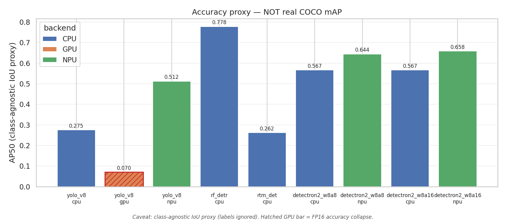
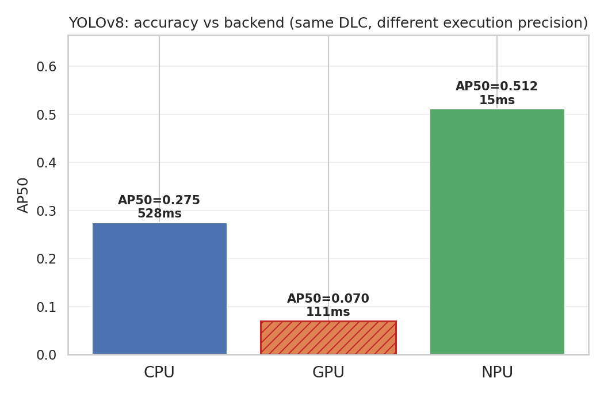
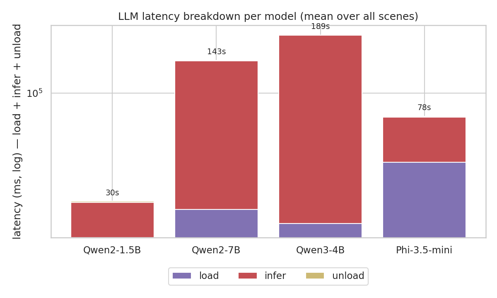
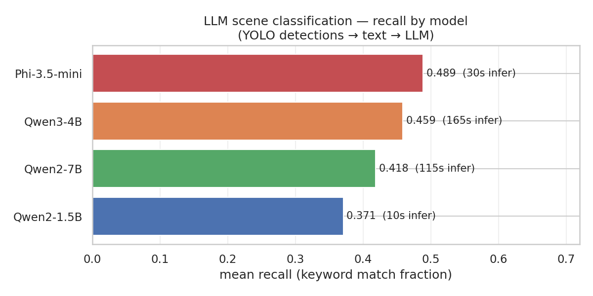
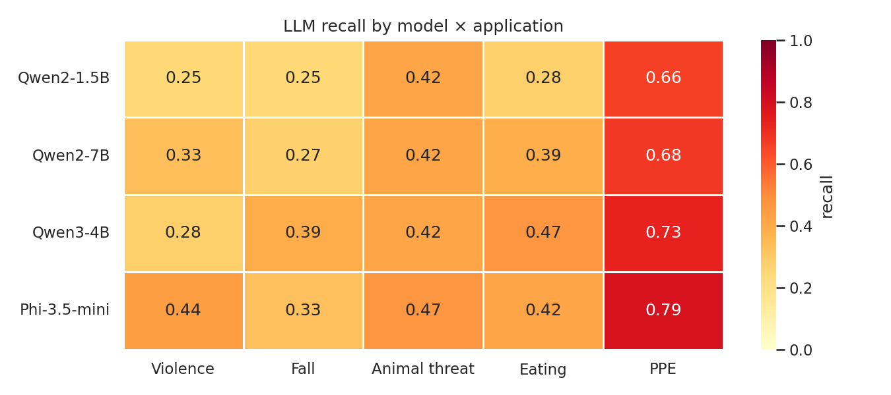
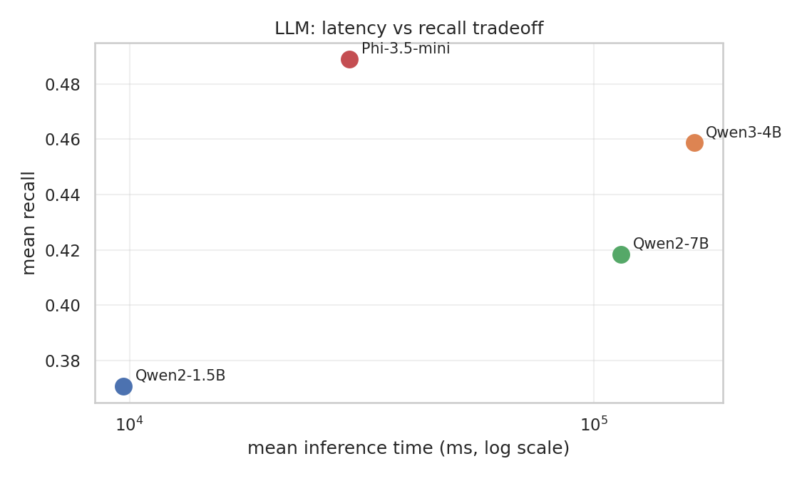

<!-- _class: lead -->

# Edge Detection + LLM Reasoning on QCS6490

### Update 2026-06-18

---

## Today's update

1. **Detection accuracy revisited** — full results across all models × backends
2. **YOLOv8 GPU collapse** — root cause analysis
3. **LLM text-classification benchmark** — YOLO detections → LLM → scene label

---

## Detection accuracy (all models × backends)

**RF-DETR CPU** best overall (0.778). **Detectron2 NPU** best on-device balance (0.644–0.658). **YOLOv8 NPU** fastest + decent (0.512, 15 ms). **YOLOv8 GPU** collapses (0.070).

---

## YOLOv8 GPU: what we see

GPU is fast (111 ms), but AP50 drops from 0.275 (CPU) to **0.070** — accuracy is unusable.

---

## YOLOv8 GPU: root cause

CPU and GPU both run the **same float DLC**. NPU uses a separate context binary.

The QNN GPU backend runs in **hybrid mode**: FP32 weights are **compressed to FP16** for storage, with math accumulated in FP32.

FP16 has a 10-bit mantissa and max value ≈ 65504. Compressing FP32 → FP16 loses precision for values not representable in that narrower format. In a deep CNN this precision error accumulates layer by layer → the output logit distribution shifts → YOLO confidence scores (passed through `sigmoid` and compared against a fixed NMS threshold) fall below the cutoff → nearly all predictions are suppressed → **AP50 collapses to 0.07**.

**Evidence:** collapse is fully deterministic (same images across all 3 runs); images 25 and 29 score 1.0 on GPU too — single dominant objects with logits large enough to survive the shifted distribution.

**Fix (future):** run GPU backend in FP32 weight mode, or re-export a DLC quantized to FP16 so compression is lossless.

---

## LLM benchmark: setup

**Pipeline:** YOLO detections → structured text prompt → LLM → YES / NO / label

**Models (CPU, via llama-server):**

| Model | Params |
|---|---|
| Qwen2-1.5B | 1.5B |
| Qwen2-7B | 7B |
| Qwen3-4B | 4B |
| Phi-3.5-mini | 3.8B |

**Workload:** 5 apps × 2 scenes × 3 cycles (30 inferences per model)

**Metric:** recall = fraction of expected keywords present in response (case-insensitive)

---

## LLM benchmark: latency breakdown

Load dominates for large models. **Qwen2-1.5B** cheapest end-to-end (≈30 s total). **Qwen3-4B** heaviest (>3 min).

---

## LLM benchmark: accuracy

**Phi-3.5-mini** best recall (0.489, 30 s/infer). **Qwen2-1.5B** worst recall but **17× faster** (10 s) — edge sweet spot.

---

## LLM benchmark: recall by app

**PPE compliance** easiest for all models (0.66–0.79). **Violence / fall** hardest (0.25–0.44).

---

## LLM benchmark: latency vs recall

Qwen2-1.5B: 10× faster than Phi-3.5-mini with only −0.12 recall gap. Qwen3-4B: 165 s/infer with no accuracy gain over Phi-3.5-mini.

---

## Summary

| Use case | Best pick | Key metric |
|---|---|---|
| Fastest detection (NPU) | YOLOv8 NPU | **15 ms**, 67 FPS |
| Highest detection accuracy | RF-DETR CPU | AP50 **0.778** |
| On-device detection (NPU) | Detectron2 w8a8 NPU | AP50 0.644, 377 ms |
| Edge LLM (speed) | Qwen2-1.5B | recall 0.37, **10 s** |
| LLM (best accuracy) | Phi-3.5-mini | recall **0.49**, 30 s |

**GPU:** YOLOv8 GPU fast (111 ms) but AP50=0.07 — FP16 sigmoid underflow, not usable.

**Next:** VLM benchmark — video frames directly into VLM (no YOLO intermediary).
